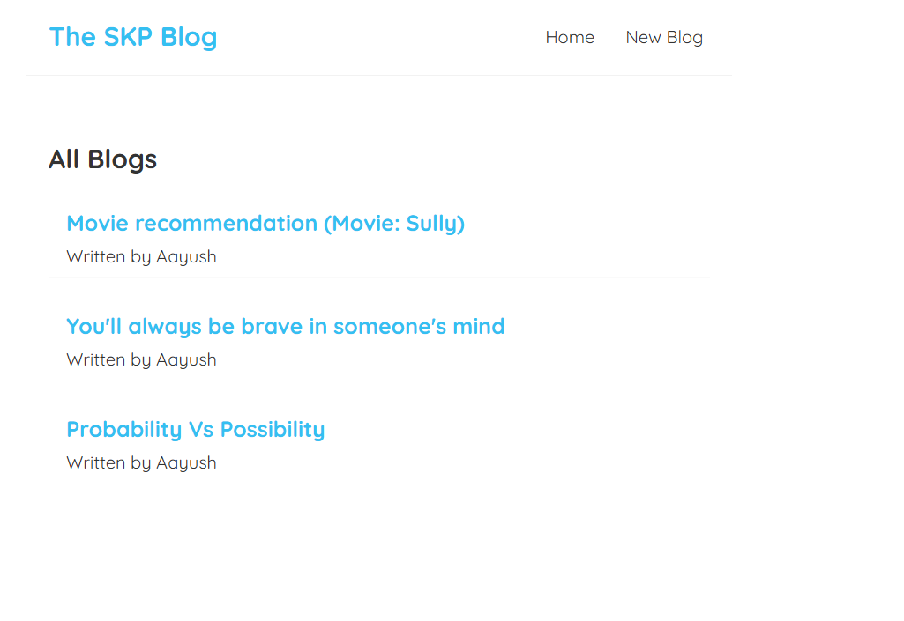
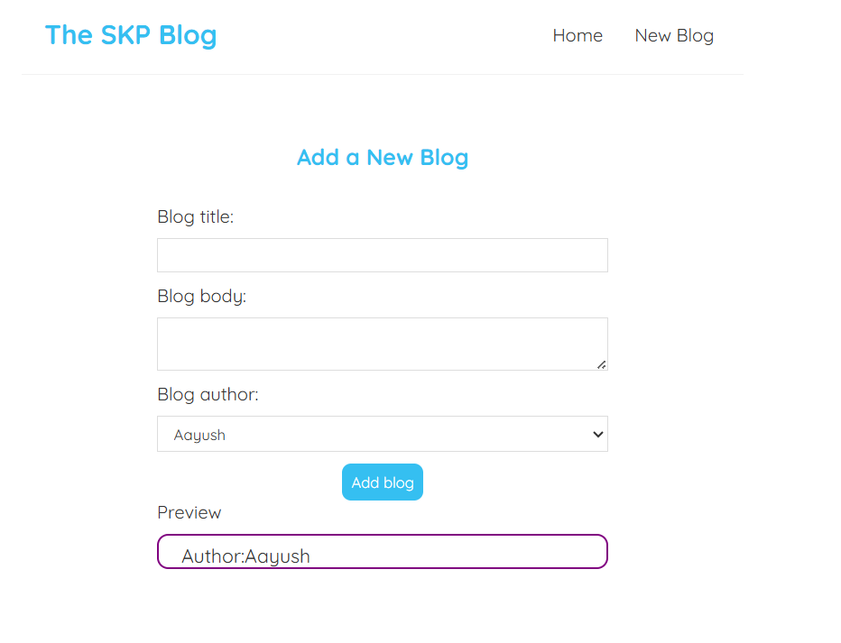

# Blog Posting Platform

Welcome to the **Blog Posting Platform** repository! This platform allows users to create, delete, and read blogs easily. It serves as a simple website designed to clarify fundamental concepts.

## Features

- Create and publish blog posts
- Edit and delete posts
- Prototype creation using blog content
- User-friendly interface

## Tech Stack

- **Frontend:** React, React Router, CSS
- **Backend:** JSON Server for mock API

## Getting Started

### Prerequisites

- Ensure you have [Node.js](https://nodejs.org/) installed.
- Install dependencies by running:
  ```sh
  npm install
  ```

### Running the Project

1. Start the mock backend using JSON Server:
   ```sh
   npx json-server --watch data/db.json --port 8000
   ```
2. Start the React development server:
   ```sh
   npm start
   ```

## Preview

### Blog Preview Page




### Create New Blog Page



## Contributing

Contributions are welcome! Feel free to submit issues and pull requests.
